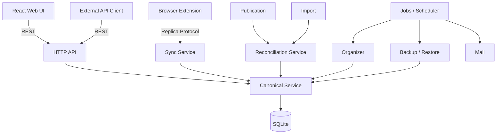

# 01. 系统总体架构

## 1. 模块视图



## 2. 三个“核心脑”

### Canonical Domain

管理当前权威树与所有 Canonical 写入：

- SyncSpace；
- RootSlot；
- Node；
- CREATE / UPDATE / MOVE / DELETE；
- tree validation；
- revision；
- journal；
- tombstone；
- ChangeSet / Undo Before Image。

### Sync Conflict Engine

解决“时间与并发”的问题：

- stale base revision；
- same-field concurrent update；
- concurrent move；
- DELETE vs stale mutation；
- stale anchor rebase；
- same-binding causal ordering；
- Operation Receipt / idempotency。

### Tree Reconciliation Engine

解决“Source Tree 如何应用到 Target Tree”的问题：

- Initial Sync；
- Import；
- Publication Apply；
- Full Resync；
- Mapping-lost Recovery；
- Merge / Replace；
- Preview / Plan。

Sync Conflict Engine 与 Reconciliation Engine 不应混成一个万能 Merge Engine。

## 3. 写入路径不变量

任何 Canonical 修改只能经：

```text
Source Intent
   ↓
Authorization
   ↓
Domain Command / Tree Plan
   ↓
Canonical Executor
   ↓
SQLite Transaction
   ├── Nodes
   ├── Revisions
   ├── Journal
   ├── Tombstones
   ├── ChangeSet / Undo
   └── Receipt（若来自 /sync）
```

禁止 Controller、Job Handler、Publication Service、Organizer 直接执行 `UPDATE nodes` 绕过 Domain。

## 4. 数据分类

### Durable Domain State

真正属于用户资产或系统身份：

- users；
- sync_spaces；
- root_slots；
- nodes；
- publications / versions；
- successful backup catalog；
- system settings。

### Sync Protocol State

可由协议生命周期淘汰：

- journal；
- tombstones；
- operation receipts；
- device bindings；
- reconciliation sessions。

### Derived / Temporary State

删除后能够 rebuild / retry：

- search metadata；
- organizer scan items；
- diagnostic events；
- temporary snapshots；
- preview plans；
- export temporary files。

## 5. Transaction Boundary

### 短 SQL Transaction

可放：

- Canonical mutation；
- revision allocation；
- journal；
- tombstone；
- receipt；
- ChangeSet；
- Undo Before Image。

### 禁止放在 SQL Transaction 内

- SMTP；
- HTTP Link Check；
- WebDAV / S3 上传；
- Browser API；
- 长时间压缩；
- 用户等待 Preview 决策。

原则：**Long-running Job ≠ Long-running Database Transaction**。

## 6. SQLite 并发模型

V1 为单 Server 进程，Canonical Write 按 SQLite write transaction 序列化。每个 Space 的 Revision 因而天然获得线性顺序。

系统不为了未来多 Server 提前引入分布式锁或外部数据库。
